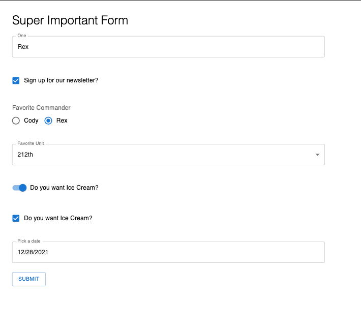

# MUI Form Generator

An API for crafting MUI powered forms.

[](https://www.npmjs.com/package/@caldwell619/mui-form-generator) [](https://www.npmjs.com/package/@caldwell619/mui-form-generator) []() []()

## Prerequisite

You'll need to fully setup MUI, following [this](https://mui.com/getting-started/installation/) guide.

This is based on MUI v5, using **only** v4 will not work with this.

## Getting Started

```shell
yarn add @caldwell619/mui-form-generator
```

## Supported Inputs

Currently, there are only 2 supported inputs, but this list will grow with time.

- Single Checkbox
- Multi Checkbox ( WIP :caution: )
- Custom Overrides
- Radio
- Select
- Switch
- Text

## Quick Exmple

The following will render a single text input with a label of "One".

### Highlights

- The `name` property must match one of your object keys. This is the same behavior as [react-hook-form](https://react-hook-form.com/).
- Each type of input has their own `config`. The specifics are determined by the `type` property. For example, `select` requires you to pass `options`.

### Proivider

**You must add a provider that wraps your form FOR EACH FORM YOU USE. **

This is not shown in this example, but is shown in [this one](./example/src/App.tsx), with just the single form.

### Code

```tsx
import { FC, useContext } from 'react'
import { MuiForm, Config, MuiFormContext } from '@caldwell619/mui-form-generator'
import { Button } from '@mui/material'
import { UseFormReturn } from 'react-hook-form'
import { diff } from 'deep-object-diff'

export const defaultValues: SomeObject = {
  one: 'Rex',
  two: 'Cody',
  three: 'Wolffe'
}

const inputs: Config<SomeObject>[] = [
  {
    type: 'text',
    config: {
      control: {
        name: 'one',
        label: 'One'
      }
    }
  }
]

export const Form: FC = () => {
  const { handleSubmit } = useContext<UseFormReturn<SomeObject>>(MuiFormContext)
  const onSubmit = (data: SomeObject) => {
    console.log('Current state of form', data)
  }
  return (
    <form>
      <MuiForm inputs={inputs} />
      <Button variant='outlined' onClick={handleSubmit(onSubmit)}>
        Submit
      </Button>
    </form>
  )
}

export interface SomeObject {
  one: string
  two: string
  three: string
}
```

### Result

The result is just a single input and your button under it. Clicking submit will console log an object showing your defaults:

```ts
{
  one: 'Rex',
  two: 'Cody',
  three: 'Wolffe'
}
```


## Detailed Example

There is a working example with a select input and a text field that can be found [here](./example/src/App.tsx)

## Custom Overrides

You can "easily" pass your own custom input into the render. For an example, see the [Date override](./example/src/components/Date.tsx).

This is an example of using a Date picker, which is not supported natively by this tool, because they are so specific. 
There are many different kinds, as well as requiring `@mui/lab` as a peer dependency.

### Component

```tsx
import { CustomOverrideRenderArgs } from '@caldwell619/mui-form-generator'

export const FormInputDate: FC<CustomOverrideRenderArgs<SomeObject>> = ({
  field: { value, onChange },
  fieldState: { error }
}) => {
  return (
    <LocalizationProvider dateAdapter={AdapterDateFns}>
      <DateTimePicker
        value={value}
        onChange={onChange}
        renderInput={params => <TextField fullWidth {...params} error={!!error} />}
      />
    </LocalizationProvider>
  )
}
```

## Schema API

```ts
{
  type: 'custom',
  config: {
    control: {
      name: 'startDate',
      children: props => <FormInputDate {...props} />
    }
  }
}
```

## All the inputs together from the example

