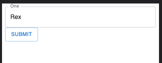

# MUI Form Generator

An API for crafting MUI powered forms.

[](https://www.npmjs.com/package/@caldwell619/react-ticker) [](https://www.npmjs.com/package/@caldwell619/react-ticker) []() []()

## Prerequisite

You'll need to fully setup MUI, following [this](https://mui.com/getting-started/installation/) guide.

## Getting Started

```shell
yarn add @caldwell619/mui-form-generator
```

## Supported Inputs

Currently, there are only 2 supported inputs, but this list will grow with time.

- Basic Text
- Select

## Quick Exmple

The following will render a single text input with a label of "One".

### Highlights

- The `name` property must match one of your object keys. This is the same behavior as [react-hook-form](https://react-hook-form.com/).
- Each type of input has their own `config`. The specifics are determined by the `type` property. For example, `select` requires you to pass `options`.
- `MuiFormContext` is provided so you can access the `handleSubmit` from anywhere.
  - **Note:** You must add the provider somewhere in your tree. (Not shown in this example, but is shown in [this one](./example/src/App.tsx))

## Code

```tsx
import { FC, useContext } from 'react'
import { MuiForm, Config, MuiFormContext } from '@caldwell619/mui-form-generator'
import { Button } from '@mui/material'
import { UseFormReturn } from 'react-hook-form'
import { diff } from 'deep-object-diff'

export const defaultValues: SomeObject = {
  one: 'Rex',
  two: 'Cody',
  three: 'Wolffe'
}

const inputs: Config<SomeObject>[] = [
  {
    type: 'text',
    config: {
      control: {
        name: 'one',
        label: 'One'
      }
    }
  }
]

export const Form: FC = () => {
  const { handleSubmit } = useContext<UseFormReturn<SomeObject>>(MuiFormContext)
  const onSubmit = (data: SomeObject) => {
    console.log('Current state of form', data)
  }
  return (
    <form>
      <MuiForm inputs={inputs} />
      <Button variant='outlined' onClick={handleSubmit(onSubmit)}>
        Submit
      </Button>
    </form>
  )
}

export interface SomeObject {
  one: string
  two: string
  three: string
}
```

### Result

The result is just a single input and your button under it. Clicking submit will console log an object showing your defaults:

```ts
{
  one: 'Rex',
  two: 'Cody',
  three: 'Wolffe'
}
```



## Detailed Example

There is a working example with a select input and a text field that can be found [here](./example/src/App.tsx)
